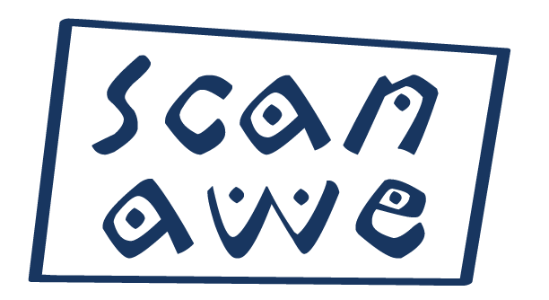

# Scanawe
Projeto final da matéria AOO (Análise Orientados a Objetos).

 
Neste projeto propõe-se o desenvolvimento do sistema Scanawe para uma empresa de consultoria, com o objetivo de “escanear” a estrutura das empresas contratantes de seus serviços, buscando conhecer a realidade cotidiana dos colaboradores de tais empresas e investigando os principais aspectos que possam estar relacionados ao Assédio no Trabalho.
